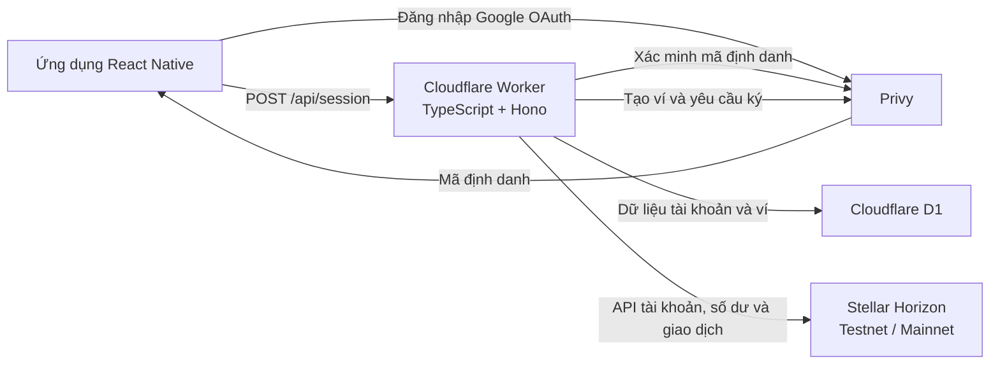

# Lumen Liquid - Bộ chuẩn bị demo Phase 1

**Ngày họp:** 14/06/2026  
**Phạm vi chính:** SOW Phase 1, ngày 1 - ngày 10  
**Mục tiêu:** Chứng minh nền tảng backend, kết nối Stellar Horizon, xác thực Privy và kiểm thử đầu cuối đã hoạt động.

## 1. Thông điệp chính

> Phase 1 đã hoàn thành về mặt chức năng: backend đã được triển khai công khai, kết nối Stellar Horizon, tích hợp xác thực Privy, tạo hoặc khôi phục ví Stellar và đã xác minh giao dịch trên Stellar Testnet.

Ví mobile, hoán đổi tài sản, WalletConnect, KYC và cổng chuyển đổi VND là những phần đã phát triển thêm. Chỉ giới thiệu ngắn nếu còn thời gian; không dùng chúng làm trọng tâm nghiệm thu Phase 1.

## 2. Điểm cần nói rõ về kiến trúc

SOW ghi **kiến trúc microservice bằng Go**, nhưng backend hiện tại được triển khai bằng:

- TypeScript + Hono.
- Cloudflare Workers.
- Cloudflare D1.
- Privy Node SDK/API.
- Stellar SDK + Horizon API.

Cách trình bày:

> SOW ban đầu đề xuất kiến trúc microservice bằng Go. Trong quá trình triển khai, team đã chuyển backend sang TypeScript và Hono trên Cloudflare Workers. Các kết quả chức năng của Phase 1 vẫn được giữ nguyên: backend đã triển khai, kết nối Stellar Horizon, xác thực Privy và kiểm thử đầu cuối trên Testnet.

Không nói backend hiện tại là Go. Nếu bên Stellar coi Go là yêu cầu bắt buộc theo hợp đồng, đây là điểm cần xác nhận lại về tiêu chí nghiệm thu.

## 3. Đối chiếu Phase 1

| Giai đoạn | Công việc theo SOW | Kết quả thực tế | Trạng thái / vướng mắc |
|---|---|---|---|
| Ngày 1 - 3 | Thiết lập hạ tầng microservice bằng Go và cấu hình môi trường phát triển. | Nền tảng backend đã được triển khai bằng TypeScript/Hono trên Cloudflare Workers; có định tuyến API, CORS, xử lý lỗi, nhật ký có cấu trúc, cơ sở dữ liệu D1 và quản lý biến bí mật. | Hoàn thành về kết quả chức năng. Có thay đổi công nghệ so với Go trong SOW. |
| Ngày 4 - 6 | Kết nối backend Go với Stellar Horizon API. | Worker kết nối được Stellar Horizon trên Testnet và Mainnet; hỗ trợ cấu hình mạng, tra cứu tài khoản/số dư, danh sách tài sản, Friendbot Testnet, trustline, gửi và submit giao dịch. | Hoàn thành. Hai giao dịch Testnet đã được xác minh thành công. |
| Ngày 7 - 9 | Tích hợp xác thực Privy trên Testnet để hỗ trợ đăng nhập mạng xã hội. | Mobile đăng nhập Google qua Privy và lấy identity token; Worker xác minh token với Privy, lấy email, tạo hoặc khôi phục ví Stellar và lưu liên kết tài khoản trong D1. | Hoàn thành. Phiên đăng nhập tự khôi phục khi mở lại ứng dụng. |
| Ngày 10 | Kiểm thử đầu cuối kết nối Horizon và luồng xác thực Privy. | Worker công khai đang hoạt động; backend kiểm tra kiểu dữ liệu thành công, 28 bài kiểm thử tự động thành công; mobile kiểm tra TypeScript thành công; mã giao dịch được xác minh trực tiếp trên Horizon Testnet. | Hoàn thành. Không có vướng mắc trong Phase 1. |

## 4. Sơ đồ kỹ thuật



Luồng đăng nhập:

1. Người dùng chọn **Tiếp tục với Google**.
2. Privy hoàn tất Google OAuth và trả thông tin người dùng cùng identity token cho mobile.
3. Mobile gửi identity token và mạng đang chọn đến `POST /api/session`.
4. Worker dùng Privy Node SDK xác minh token và lấy email từ hồ sơ người dùng.
5. Worker tìm tài khoản theo email trong D1.
6. Nếu chưa có tài khoản, Worker tạo ví Stellar qua Privy và lưu metadata của ví vào D1.
7. Worker đọc số dư và lịch sử giao dịch từ Horizon rồi trả phiên làm việc cho mobile.

Luồng giao dịch Stellar:

1. Worker kiểm tra người dùng, ví, mạng, địa chỉ và số lượng.
2. Worker tạo giao dịch Stellar bằng Stellar SDK.
3. Worker gửi mã băm giao dịch sang Privy để ký.
4. Worker gắn chữ ký vào giao dịch.
5. Worker gửi giao dịch lên Horizon.
6. Horizon trả mã giao dịch và trạng thái.

Backend không lưu private key dạng thô trong bảng `accounts`; D1 chỉ lưu metadata của tài khoản và ví. Việc ký được yêu cầu qua Privy.

## 5. Kịch bản demo 8 - 10 phút

### 0:00 - 0:40 — Mở đầu

Nói:

> Hôm nay tôi sẽ tập trung vào bốn hạng mục của Phase 1: nền tảng backend, kết nối Stellar Horizon, xác thực người dùng bằng Privy và kiểm thử đầu cuối trên Testnet. Dự án hiện đã phát triển vượt Phase 1, nhưng phần demo này sẽ bám sát phạm vi SOW.

### 0:40 - 2:00 — Ngày 1 - 3: Nền tảng backend

Trình chiếu:

1. Kho mã nguồn và thư mục `worker-api`.
2. Điểm khởi chạy Worker, các route, CORS và bộ xử lý lỗi chung.
3. `wrangler.toml`: cấu hình Worker, Horizon URL và liên kết D1.
4. Cấu trúc D1: bảng `accounts`.
5. API kiểm tra trạng thái công khai.

Nói:

> Backend được triển khai dưới dạng Cloudflare Worker. Hono đảm nhiệm định tuyến API, D1 lưu metadata của tài khoản và ví, các biến bí mật chỉ nằm ở phía server và nhật ký lỗi có trace ID để tra cứu.

### 2:00 - 4:00 — Ngày 4 - 6: Stellar Horizon

Trình chiếu:

1. `/api/networks` trả Stellar Testnet và Mainnet.
2. `/api/assets?network=testnet` trả XLM và USDC Testnet.
3. Ứng dụng đang ở Testnet, hiển thị địa chỉ ví và số dư.
4. Mở một mã giao dịch trên Stellar Expert hoặc Horizon.

Nói:

> Cấu hình mạng được tách rõ ràng. Testnet dùng Horizon Testnet và Friendbot, còn Mainnet dùng Horizon Mainnet công khai. Backend có thể tải tài khoản, số dư, lịch sử giao dịch, tạo giao dịch, yêu cầu Privy ký và gửi lên Horizon.

Không cần gửi giao dịch trực tiếp nếu thời gian ngắn. Mã giao dịch đã thành công là bằng chứng ổn định hơn.

### 4:00 - 6:30 — Ngày 7 - 9: Xác thực Privy

Trình chiếu:

1. Màn hình **Tiếp tục với Google**.
2. Đăng nhập Google hoặc video dự phòng của quá trình đăng nhập.
3. Sau đăng nhập: email tài khoản, ví Stellar và số dư Testnet.
4. Có thể đóng/mở lại ứng dụng để trình bày việc khôi phục phiên nếu đã kiểm tra trước.

Nói:

> Trong luồng đã xác thực, mobile không tự gửi một email để backend mặc nhiên tin tưởng. Mobile gửi Privy identity token. Worker xác minh token với Privy, lấy email đã xác thực và dùng email đó làm khóa tài khoản trong D1.

### 6:30 - 8:30 — Ngày 10: Bằng chứng kiểm thử đầu cuối

Trình chiếu trên terminal:

```bash
cd /Users/namdeptrai/Documents/react-native/Privy/worker-api
npm run typecheck
npm test
```

Kết quả đã kiểm tra ngày 14/06/2026:

```text
Test Files  3 passed (3)
Tests       28 passed (28)
```

Mobile:

```bash
cd /Users/namdeptrai/Documents/react-native/Privy/mobile
npx tsc --noEmit
```

Kết quả: thành công, không có lỗi TypeScript.

Kết luận:

> Các bằng chứng này bao phủ toàn bộ luồng Phase 1: xác thực, tìm hoặc tạo tài khoản và ví, kết nối Horizon, ký và gửi giao dịch Testnet thành công.

### 8:30 - 9:00 — Phần vượt Phase 1

Chỉ nói ngắn:

> Ngoài Phase 1, team cũng đã bắt đầu phát triển ví mobile, hoán đổi tài sản, WalletConnect, KYC và luồng chuyển đổi VND. Những phần này không phải bằng chứng bắt buộc cho buổi đánh giá Phase 1 hôm nay.

Không demo KYC trực tiếp trong cuộc họp hiện tại vì hệ thống của nhà cung cấp đang giới hạn kích thước yêu cầu ảnh bằng Nginx HTTP 413.

## 6. Bằng chứng cần mở sẵn trước cuộc họp

### Các API công khai

- [Trạng thái Worker](https://privy-stellar-api.namvu3121.workers.dev/api/health)
- [Các mạng được hỗ trợ](https://privy-stellar-api.namvu3121.workers.dev/api/networks)
- [Các tài sản trên Testnet](https://privy-stellar-api.namvu3121.workers.dev/api/assets?network=testnet)
- [Kho mã nguồn GitHub](https://github.com/prompttocode/Privy)
- [Commit tham chiếu hiện tại](https://github.com/prompttocode/Privy/commit/85522d4d318803163c4ac7344a966639b66efab3)

### Các giao dịch Testnet thành công

- [Giao dịch 800852ee...740b](https://stellar.expert/explorer/testnet/tx/800852ee4278b12c16ebd0ec80f7946d0be3b645e370b79feb30423099fd740b)
  - `successful: true`
  - Sổ cái `2720590`
  - `2026-05-24T08:56:23Z`
- [Giao dịch b1c2c763...cd3a](https://stellar.expert/explorer/testnet/tx/b1c2c763b3cfb7cd01a271abf4e5d0ccc8e05ab98e6f0138d09792240bb8cd3a)
  - `successful: true`
  - Sổ cái `2720560`
  - `2026-05-24T08:53:52Z`

### Bằng chứng trong mã nguồn

- [Điểm khởi chạy Worker](/Users/namdeptrai/Documents/react-native/Privy/worker-api/src/index.ts:11)
- [Các route trạng thái, mạng và phiên làm việc](/Users/namdeptrai/Documents/react-native/Privy/worker-api/src/routes/base.ts:44)
- [Privy client và tạo ví](/Users/namdeptrai/Documents/react-native/Privy/worker-api/src/core.ts:391)
- [Lưu tài khoản trong D1](/Users/namdeptrai/Documents/react-native/Privy/worker-api/src/core.ts:655)
- [Ký bằng Privy và gửi qua Horizon](/Users/namdeptrai/Documents/react-native/Privy/worker-api/src/core.ts:1908)
- [Các route Stellar](/Users/namdeptrai/Documents/react-native/Privy/worker-api/src/routes/stellar.ts:420)
- [Cấu hình Cloudflare Worker](/Users/namdeptrai/Documents/react-native/Privy/worker-api/wrangler.toml:1)
- [Cấu trúc cơ sở dữ liệu D1](/Users/namdeptrai/Documents/react-native/Privy/worker-api/schema.sql:1)
- [Đăng nhập Google và khôi phục phiên phía mobile](/Users/namdeptrai/Documents/react-native/Privy/mobile/src/hooks/useWallet.ts:846)

## 7. Câu hỏi kỹ thuật có thể gặp

### Vì sao dùng Cloudflare Workers thay vì Go microservices?

> Team thay đổi công nghệ để giảm chi phí triển khai và vận hành trong Phase 1. Cloudflare Workers cung cấp môi trường serverless công khai, liên kết D1, quản lý biến bí mật và khả năng giám sát trong cùng một hệ thống. Giao diện và hành vi chức năng của Phase 1 vẫn được giữ nguyên. Team xác nhận đây là thay đổi công nghệ so với SOW ban đầu và sẵn sàng làm rõ nếu Go là tiêu chí nghiệm thu bắt buộc.

### Privy nằm ở đâu trong luồng bảo mật?

> Privy xử lý xác thực người dùng và hạ tầng ví. Mobile nhận identity token sau khi đăng nhập Google OAuth. Worker xác minh token này ở phía server trước khi tìm tài khoản. Yêu cầu tạo ví và ký giao dịch được gửi tới Privy; private key dạng thô không được lưu trong bảng tài khoản D1.

### Backend có tin email mobile gửi lên không?

> Trong luồng đã xác thực, không. Worker xác minh identity token với Privy rồi tự lấy email từ hồ sơ người dùng do Privy trả về.

Backend hiện vẫn còn cơ chế dùng email dự phòng và các route `/api/demo/*` để phục vụ phát triển trên Testnet. Không gọi đây là hệ thống xác thực production. Trước khi chạy Mainnet production cần tắt các route demo và bắt buộc Bearer token cho mọi thao tác tài khoản hoặc ví.

### User đăng nhập lại có tạo ví mới không?

> Không. Worker tìm tài khoản theo email trong D1. Nếu tài khoản đã tồn tại thì khôi phục ví hiện tại; chỉ tạo ví khi người dùng chưa có tài khoản hoặc chưa có ví cho mạng được chọn.

### Làm sao tách Testnet và Mainnet?

> Mỗi mạng có Horizon URL, network passphrase và chính sách Friendbot riêng. Testnet cho phép Friendbot; Mainnet không. Metadata của ví cũng chứa thông tin mạng để tránh dùng nhầm.

### Giao dịch được ký và gửi như thế nào?

> Worker tạo giao dịch bằng Stellar SDK, tính mã băm giao dịch, yêu cầu Privy ký mã băm, gắn chữ ký vào giao dịch rồi gửi qua Horizon. Phản hồi của Horizon cung cấp mã giao dịch và trạng thái cuối.

### USDC hoạt động thế nào trên Stellar?

> XLM là tài sản gốc của Stellar. USDC là tài sản được phát hành nên ví phải có trustline tới đúng đơn vị phát hành trước khi nhận hoặc giao dịch. Backend đã có nền tảng tạo giao dịch trustline.

### Nếu Horizon hoặc Privy lỗi thì sao?

> Worker trả mã trạng thái HTTP rõ ràng, không coi giao dịch là thành công khi dịch vụ bên ngoài thất bại và tạo trace ID trong bộ xử lý lỗi chung để tra cứu nhật ký.

### Backend đã sẵn sàng chạy production chưa?

> Phase 1 đã hoàn thành về mặt chức năng để xác minh trên Testnet, nhưng chưa phải bản phát hành Mainnet production. Trước production, team cần loại bỏ quyền truy cập demo cũ, bắt buộc xác thực trên mọi route nhạy cảm, giới hạn CORS, thêm giới hạn tần suất gọi API, hoàn thiện kiểm soát tuân thủ và thanh toán, sau đó thử nghiệm Mainnet với giá trị nhỏ.

### Bằng chứng Phase 1 hoàn thành là gì?

> Các API Worker công khai, mã nguồn triển khai, dữ liệu lưu trong D1, mã giao dịch Testnet thành công, backend kiểm tra kiểu dữ liệu thành công, 28 bài kiểm thử tự động thành công và mobile kiểm tra TypeScript thành công.

## 8. Câu hỏi về dòng tiền và thanh khoản

Đây là phần dễ bị hỏi sâu dù không thuộc trọng tâm Phase 1.

### Phase 1 có giữ tiền fiat hoặc cung cấp thanh khoản không?

> Không. Phase 1 xây dựng xác thực, quản lý ví và kết nối Stellar. Phase 1 chưa vận hành việc lưu ký tiền pháp định hoặc cung cấp thanh khoản production.

### Luồng mua crypto bằng VND dự kiến

1. Người dùng đăng nhập và hoàn tất KYC.
2. Ứng dụng lấy báo giá và tạo lệnh mua qua backend.
3. Người dùng chuyển VND vào tài khoản do nhà cung cấp thanh toán chỉ định.
4. Nhà cung cấp đối soát đúng số tiền và nội dung chuyển khoản.
5. Nhà cung cấp hoặc bộ phận quản lý ngân quỹ chuyển XLM/USDC vào ví Stellar của người dùng.
6. Backend cập nhật lệnh bằng API trạng thái hoặc callback và lưu lịch sử.

### Luồng bán crypto nhận VND dự kiến

1. Người dùng đăng nhập, hoàn tất KYC và nhập tài khoản ngân hàng.
2. Backend tạo lệnh rút với nhà cung cấp.
3. Người dùng gửi đúng XLM/USDC tới địa chỉ và memo của lệnh.
4. Nhà cung cấp xác nhận đã nhận tài sản trên blockchain.
5. Nhà cung cấp chuyển VND tới tài khoản ngân hàng của người dùng.
6. Backend cập nhật trạng thái hoàn tất.

### Thanh khoản đến từ đâu?

> Trong mô hình hiện tại, nhà cung cấp thanh toán hoặc bộ phận quản lý ngân quỹ của đối tác chịu trách nhiệm lượng dự trữ XLM/USDC và VND. Ứng dụng không tự tạo thanh khoản. Trước production cần giám sát số dư, giới hạn lệnh, đặt thời hạn báo giá và từ chối lệnh khi thanh khoản không đủ.

### Ai chịu rủi ro tỷ giá?

> Tỷ giá phải được khóa trong một khoảng thời gian ngắn khi tạo lệnh. Lệnh hết hạn nếu người dùng không thanh toán đúng hạn. Nhà cung cấp hoặc bộ phận quản lý ngân quỹ chịu rủi ro biến động giá trong thời gian khóa tỷ giá, vì vậy cần quy định rõ chênh lệch giá, hạn mức và thời gian hết hạn.

### Làm sao tránh trả tiền hai lần?

> Callback phải bảo đảm xử lý lặp không tạo kết quả trùng theo mã lệnh của nhà cung cấp hoặc mã thanh toán. Chỉ một lần chuyển trạng thái hợp lệ được phép kích hoạt thanh toán; tác vụ đối soát phải kiểm tra giao dịch ngân hàng, giao dịch blockchain và lệnh nội bộ.

### Doanh thu dự kiến từ đâu?

> Doanh thu có thể đến từ phí giao dịch hoặc chênh lệch giá đã công bố trong báo giá. Phase 1 chưa chốt mô hình thương mại và không nên trình bày con số khi chưa có thỏa thuận với nhà cung cấp thanh khoản hoặc thanh toán.

### Có dùng Stellar SEP-6 hoặc SEP-24 không?

> Phase 1 hiện tập trung vào nền tảng ví, Horizon và Privy. Luồng chuyển đổi VND hiện dùng API của đối tác. Khả năng tương thích SEP có thể được đánh giá để tăng tính liên thông, nhưng không thuộc phạm vi nghiệm thu Phase 1.

## 9. Checklist trước giờ họp

- [ ] Sạc máy, tắt thông báo và bật chế độ Không làm phiền.
- [ ] Dùng mạng ổn định; chuẩn bị điểm phát sóng dự phòng.
- [ ] Mở sẵn ứng dụng ở Testnet, có tài khoản và số dư.
- [ ] Không để lộ seed phrase, private key, app secret hoặc partner key.
- [ ] Mở sẵn ba API công khai.
- [ ] Mở sẵn hai liên kết giao dịch trên Stellar Expert.
- [ ] Mở mã nguồn tại `base.ts`, `core.ts`, `wrangler.toml` và `schema.sql`.
- [ ] Chạy lại kiểm thử backend và kiểm tra TypeScript mobile trước họp 30 phút.
- [ ] Kiểm tra đăng nhập Google một lần; nếu không ổn, giữ nguyên phiên đang đăng nhập.
- [ ] Quay video 30 - 60 giây về đăng nhập Google và khôi phục phiên để dự phòng.
- [ ] Chuẩn bị ảnh chụp phần triển khai Cloudflare Worker và các bảng D1.
- [ ] Không demo trực tiếp KYC, chuyển đổi tiền trên Mainnet hoặc giao dịch Mainnet.
- [ ] Giữ phần demo trong 8 - 10 phút, để thời gian cho DevRel đặt câu hỏi.
- [ ] Không dùng câu “hệ thống đã sẵn sàng production”; dùng “Phase 1 đã hoàn thành cho mục tiêu xác minh trên Testnet”.

## 10. Câu chốt

> Phase 1 đã hoàn thành về mặt chức năng. Backend đã được triển khai, xác thực Privy đã được kiểm chứng, Stellar Horizon đã được kết nối, liên kết giữa tài khoản và ví được lưu ổn định, đồng thời các giao dịch Testnet đã thành công. Giai đoạn tiếp theo sẽ tập trung hoàn thiện quy trình người dùng mới, KYC, tích hợp nhà cung cấp thanh toán, kiểm soát thanh khoản và quy trình thanh toán production.
