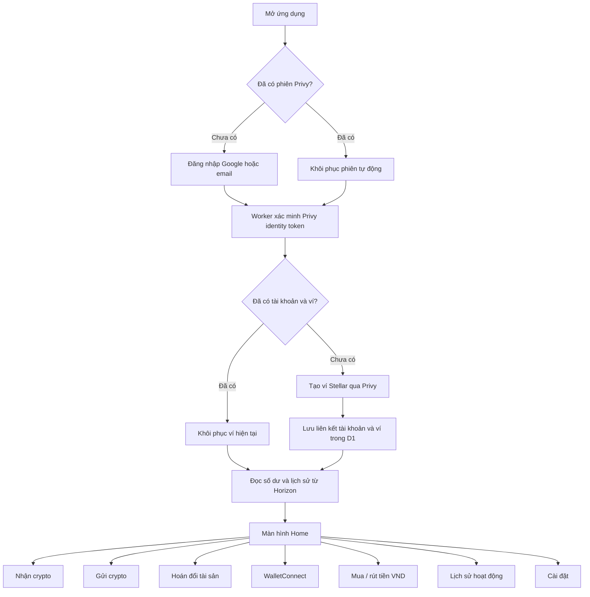
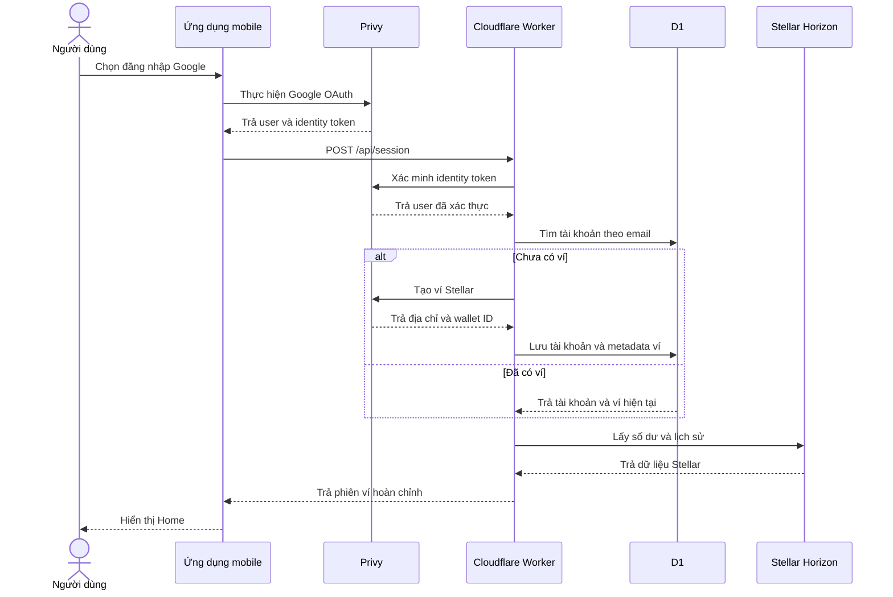

# Lumen Liquid - Luồng Ứng Dụng Hiện Tại

## 1. Tổng quan

## 2. Phần thuộc Phase 1

Phần cần tập trung trình bày trong cuộc họp:

1. Người dùng đăng nhập Google hoặc email qua Privy.
2. Mobile nhận Privy identity token.
3. Mobile gửi token tới Cloudflare Worker.
4. Worker xác minh token với Privy và lấy email đã xác thực.
5. Worker tạo mới hoặc khôi phục ví Stellar của tài khoản.
6. D1 lưu liên kết giữa tài khoản và metadata của ví.
7. Worker kết nối Horizon để lấy số dư và lịch sử giao dịch.
8. Worker có thể tạo, yêu cầu Privy ký và gửi giao dịch lên Stellar Testnet.

## 3. Các chức năng hiện có sau đăng nhập

### Nhận crypto

1. Người dùng chọn **Receive**.
2. Ứng dụng hiển thị địa chỉ ví và mã QR.
3. Người dùng sao chép hoặc chia sẻ địa chỉ để nhận XLM/USDC.

### Gửi crypto

1. Người dùng chọn tài sản, địa chỉ nhận và số lượng.
2. Ứng dụng hiển thị màn hình kiểm tra giao dịch.
3. Worker tạo Stellar transaction.
4. Privy ký transaction hash.
5. Worker gửi giao dịch lên Horizon.
6. Ứng dụng hiển thị kết quả và cập nhật lịch sử.

### Hoán đổi tài sản

1. Người dùng chọn tài sản bán, tài sản nhận và số lượng.
2. Backend lấy báo giá đường dẫn thanh toán từ Stellar.
3. Người dùng kiểm tra báo giá.
4. Worker tạo giao dịch, yêu cầu Privy ký và gửi lên Horizon.

### WalletConnect

1. Người dùng quét mã QR của Stellar dApp.
2. Ứng dụng thiết lập phiên WalletConnect.
3. Khi dApp gửi yêu cầu, ứng dụng giải mã và hiển thị nội dung XDR.
4. Người dùng chấp thuận hoặc từ chối.
5. Yêu cầu được ký qua Privy sau khi được chấp thuận.

### Mua crypto bằng VND

1. Ứng dụng kiểm tra trạng thái KYC.
2. Nếu chưa xác minh, ứng dụng yêu cầu người dùng thực hiện KYC.
3. Nếu đã xác minh, người dùng chọn XLM/USDC và số lượng.
4. Backend lấy tỷ giá, phí và tạo lệnh mua với nhà cung cấp.
5. Người dùng chuyển đúng số VND theo mã QR hoặc thông tin ngân hàng.
6. Nhà cung cấp xác nhận thanh toán và chuyển crypto vào ví Stellar.

### Bán crypto và nhận VND

1. Ứng dụng kiểm tra trạng thái KYC.
2. Người dùng chọn XLM/USDC, số lượng và tài khoản ngân hàng.
3. Backend tạo lệnh rút với nhà cung cấp.
4. Người dùng gửi crypto tới đúng địa chỉ và memo của lệnh.
5. Nhà cung cấp xác nhận giao dịch blockchain.
6. Nhà cung cấp chuyển VND vào tài khoản ngân hàng.

### Lịch sử hoạt động

- Hiển thị giao dịch Stellar.
- Hiển thị lệnh mua và rút VND.
- Cho phép mở chi tiết từng giao dịch hoặc lệnh.

### Cài đặt

- Quản lý ví và mạng Stellar.
- Xem trạng thái xác minh danh tính.
- Mở luồng KYC nếu chưa xác minh.
- Quản lý các kết nối WalletConnect.
- Đăng xuất tài khoản Privy.

## 4. Trạng thái cần nói rõ

| Luồng | Trạng thái hiện tại |
|---|---|
| Đăng nhập Privy | Hoạt động |
| Tạo hoặc khôi phục ví Stellar | Hoạt động |
| Kết nối Horizon và đọc số dư | Hoạt động |
| Gửi giao dịch Testnet | Đã có giao dịch thành công |
| Nhận crypto | Hoạt động |
| Hoán đổi tài sản | Đã kiểm thử luồng |
| WalletConnect | Đã có nền tảng kết nối, kiểm tra XDR và ký |
| Mua / rút VND | Đã có giao diện và tích hợp order foundation |
| KYC CCCD | Luồng ứng dụng đã có; upload ảnh hiện bị nhà cung cấp trả HTTP 413 |
| Mainnet production | Chưa công bố production-ready |

## 5. Cách trình bày ngắn trong cuộc họp

> Người dùng đăng nhập qua Privy. Backend xác minh danh tính, tạo hoặc khôi phục ví Stellar và lưu liên kết tài khoản trong D1. Sau đó backend dùng Horizon để đọc số dư, lịch sử và gửi giao dịch. Từ màn hình Home, người dùng có thể nhận, gửi, hoán đổi tài sản, kết nối dApp và sử dụng các luồng mua hoặc rút VND đang được phát triển thêm. Phần đăng nhập, ví, Horizon và giao dịch Testnet là trọng tâm đã hoàn thành của Phase 1.

