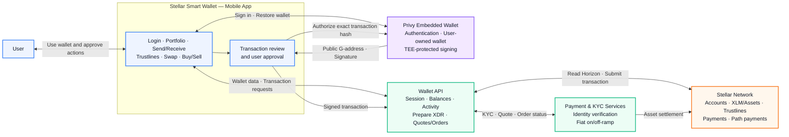

# Stellar Smart Wallet

## High-Level System Architecture

Stellar Smart Wallet is a mobile wallet that lets users access Stellar through familiar sign-in methods, review transactions in plain language, and authorize every signature without managing a secret key during normal use.

## How It Works

1. **Onboarding** — The user signs in with email, Google, or Apple. Privy creates or restores the user's embedded Stellar wallet and returns its public `G...` address.
2. **Wallet data** — The mobile app requests balances, assets, trustlines, and activity from the Wallet API. The API reads Stellar through Horizon and returns normalized data to the app.
3. **User-authorized transactions** — For send, trustline, swap, or withdrawal actions, the API prepares the Stellar transaction. The app shows the details, the user approves, Privy signs the exact transaction hash, and the API submits the signed transaction to Stellar.
4. **Fiat and KYC flow** — Buy/sell requests are coordinated through configured payment and KYC services. The app shows the resulting order status while asset settlement is recorded on Stellar.

## Key Architecture Principles

- **User-owned wallet:** the user controls transaction authorization.
- **Protected signing:** the mobile app and Wallet API do not store the complete Stellar secret key; Privy protects the wallet material and performs authorized signing inside its secure infrastructure.
- **No custom smart contract:** the current product uses Stellar Classic accounts, assets, trustlines, payments, and path payments through Horizon; it does not deploy a project-owned Soroban contract.
- **Clear network separation:** Mainnet and Testnet use separate network configuration, data, and transaction flows.
